# Solar-RS485-Monitor

RS485/시리얼 통신으로 태양광 인버터 데이터를 수집하는 모니터링 스크립트입니다.

수집기는 인버터 데이터를 읽고, 파싱된 결과를 JSON으로 출력하며, 선택적으로 외부 로깅 sink에 기록할 수 있습니다.

현재 기본 protocol profile은 InoElectric IEPVS-3.5-G1/G2 기준으로 검증되어 있습니다.

선택적 로깅 sink는 `src/solar_rs485_monitor/sinks/` 아래의 별도 모듈로 구현하며, Telegram 이벤트 알림은 `src/solar_rs485_monitor/alerts/` 아래에 별도로 구현합니다. 이렇게 해서 인버터 수집 로직과 SQLite, Google Sheets, ThingSpeak, MariaDB, Supabase(PostgreSQL), OpenSearch 또는 Elasticsearch 같은 외부 로깅 연동을 분리하고, 알림 채널도 분리해서 관리합니다.

## 아키텍처 다이어그램

<a href="https://deepwiki.com/call518/Solar-RS485-Monitor" target="_blank" rel="noopener noreferrer">DeepWiki</a>

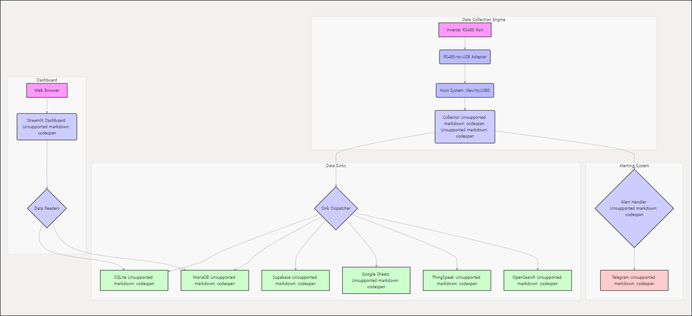

## 먼저 읽기

- 시작 전 요구사항은 [설정](#설정)과 [설정 파일](#설정-파일)에서 확인하세요.
- 가장 빠른 첫 실행은 [SQLite 빠른 시작](#sqlite-빠른-시작)부터 진행하세요.
- 대시보드와 sink별 상세 설정은 아래 섹션에 정리되어 있습니다.

## Sink 스크린샷 (선택 미리보기)

<table>
  <tr>
    <td align="center">
      <a href="images/ScreenShot-001-Streamlit.png">
        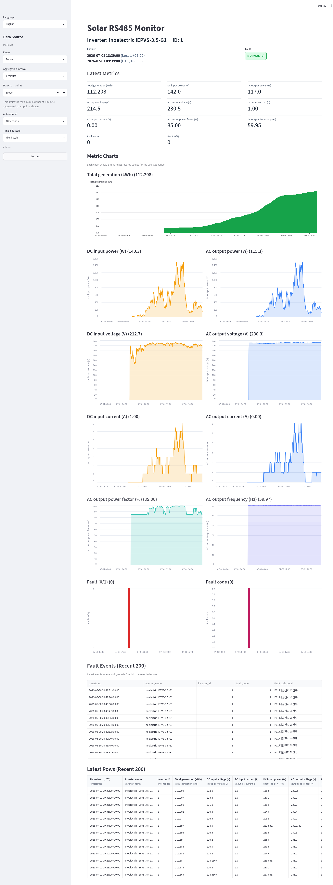
      </a>
      <br />Streamlit
    </td>
    <td align="center">
      <a href="images/ScreenShot-002-ThingSpeak.png">
        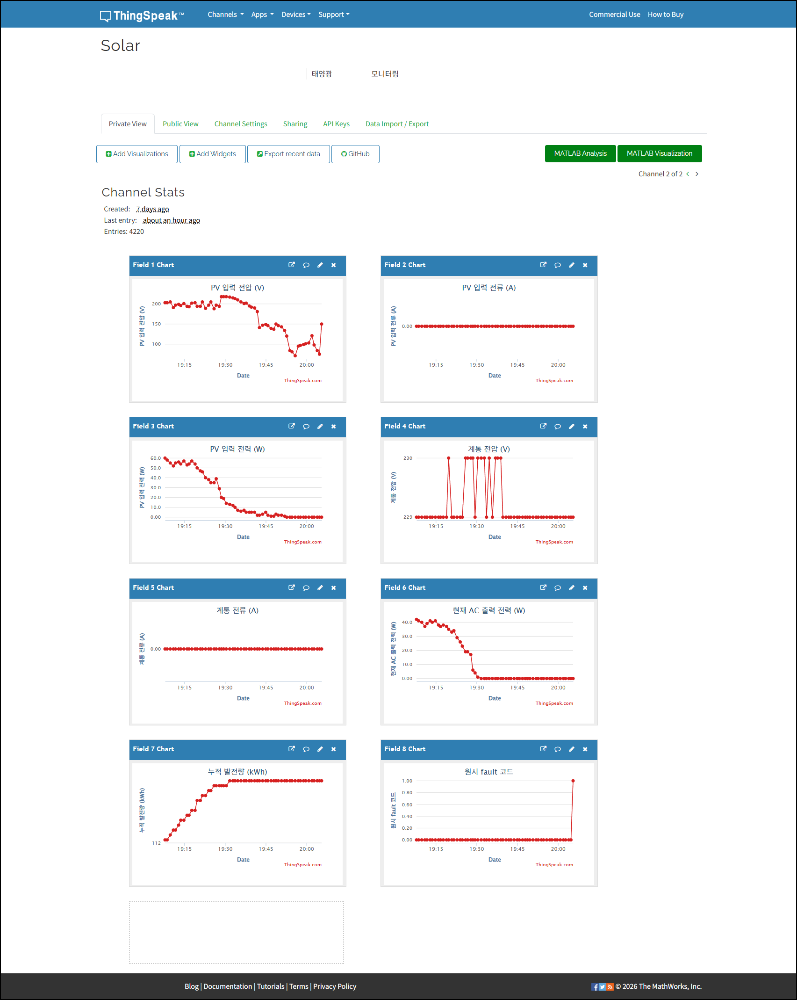
      </a>
      <br />ThingSpeak
    </td>
  </tr>
  <tr>
    <td align="center">
      <a href="images/ScreenShot-003-Google-Sheets.png">
        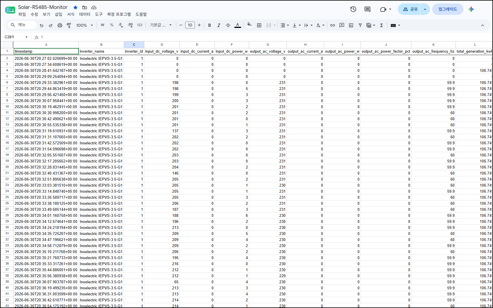
      </a>
      <br />Google Sheets
    </td>
    <td align="center">
      <a href="images/ScreenShot-004-OpenSearch.png">
        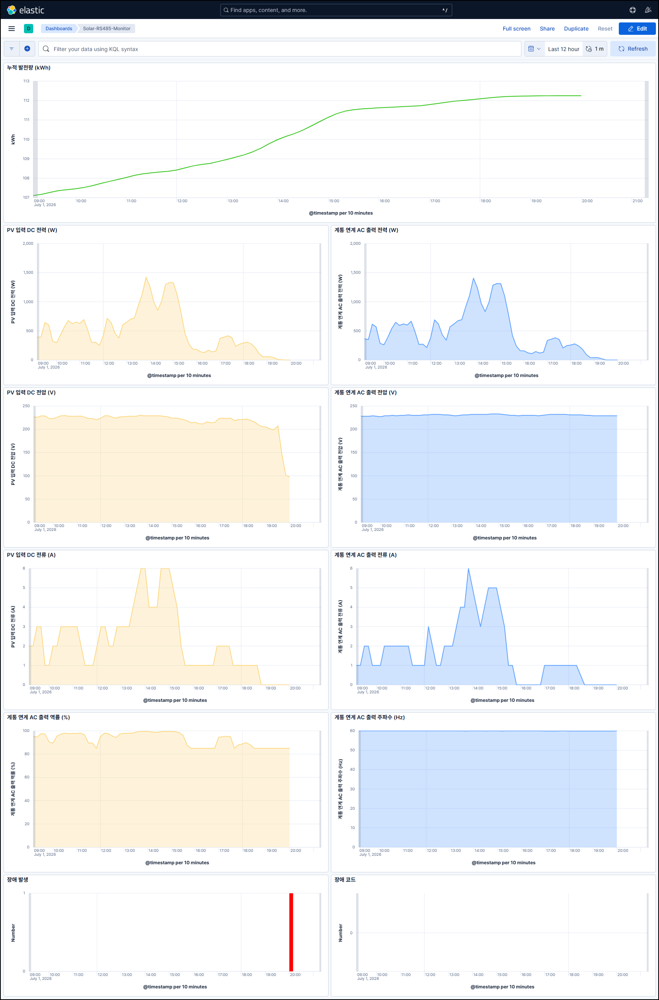
      </a>
      <br />OpenSearch
    </td>
  </tr>
</table>

## 물리 연결 및 설치 실사 (선택 미리보기)

<table>
  <tr>
    <td align="center">
      <a href="images/Photo-01-inverter-Inoelectric-IEPVS.jpg">
        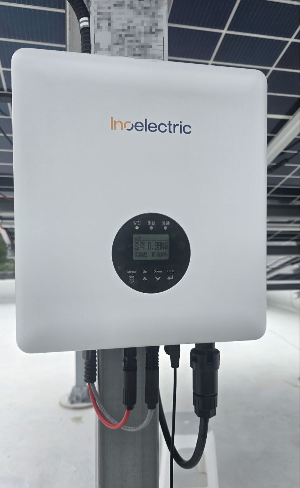
      </a>
      <br />인버터 본체
    </td>
    <td align="center">
      <a href="images/Photo-02-RS485-Cable.jpg">
        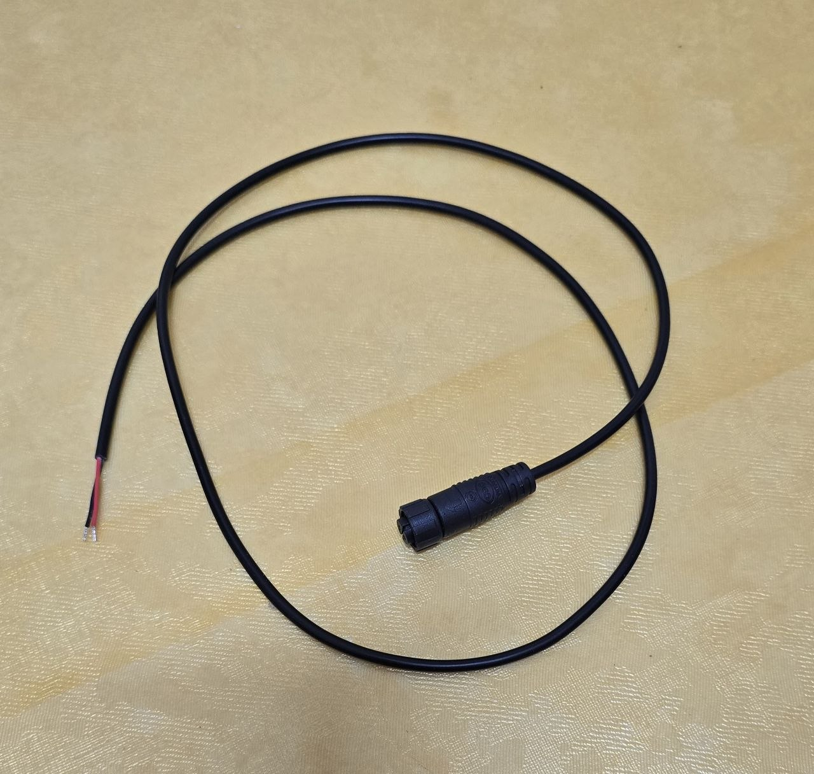
      </a>
      <br />RS485 케이블 경로 A
    </td>
    <td align="center">
      <a href="images/Photo-03-RS485-Cable.jpg">
        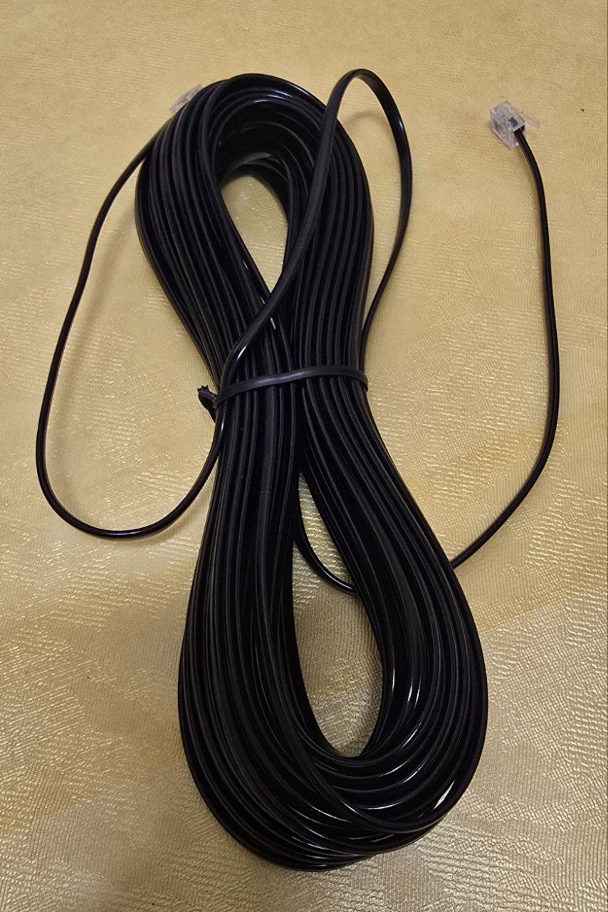
      </a>
      <br />RS485 케이블 경로 B
    </td>
  </tr>
  <tr>
    <td align="center">
      <a href="images/Photo-04-RS485-Cable.jpg">
        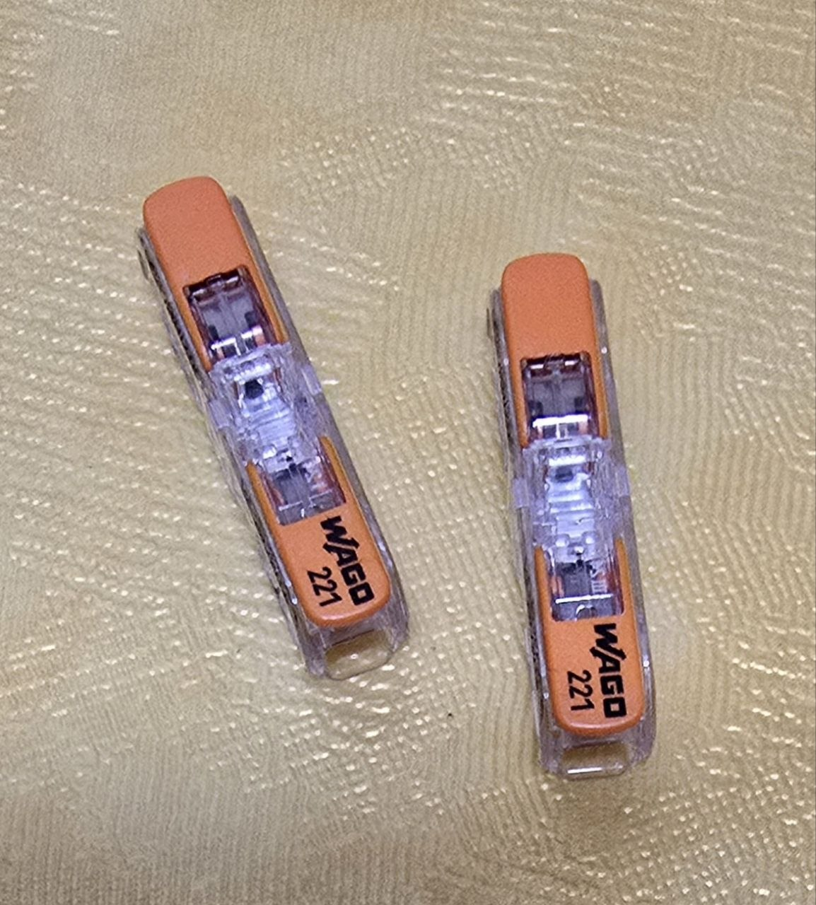
      </a>
      <br />RS485 케이블 단자
    </td>
    <td align="center">
      <a href="images/Photo-05-RS485-Cable.jpg">
        
      </a>
      <br />RS485 케이블 배선
    </td>
    <td align="center">
      <a href="images/Photo-06-FT232-RS485toUSB-Converter.jpg">
        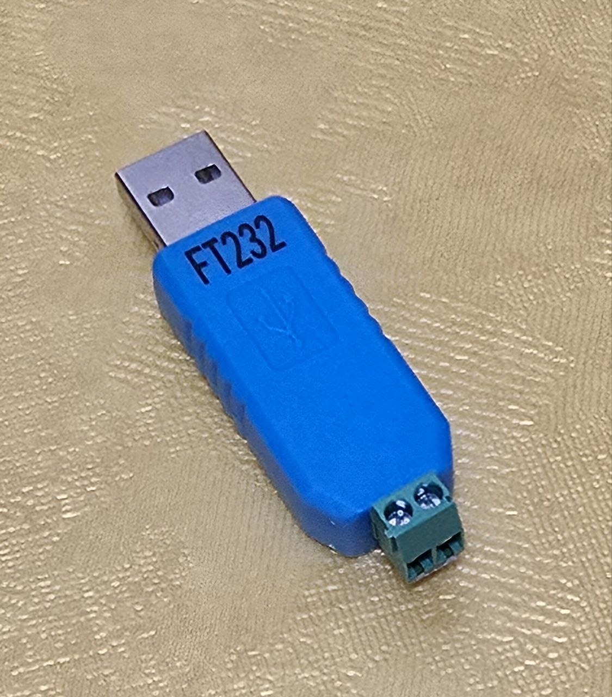
      </a>
      <br />FT232 RS485 to USB 컨버터
    </td>
  </tr>
  <tr>
    <td align="center">
      <a href="images/Photo-07-RS485-Cable.jpg">
        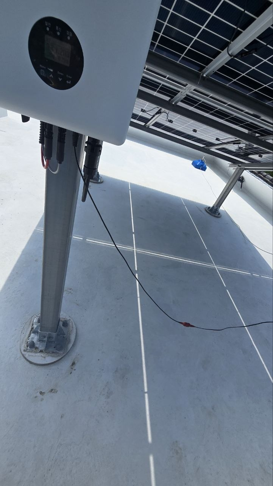
      </a>
      <br />RS485 케이블 연결 상태
    </td>
    <td align="center">
      <a href="images/Photo-08-RaspberryPi.jpg">
        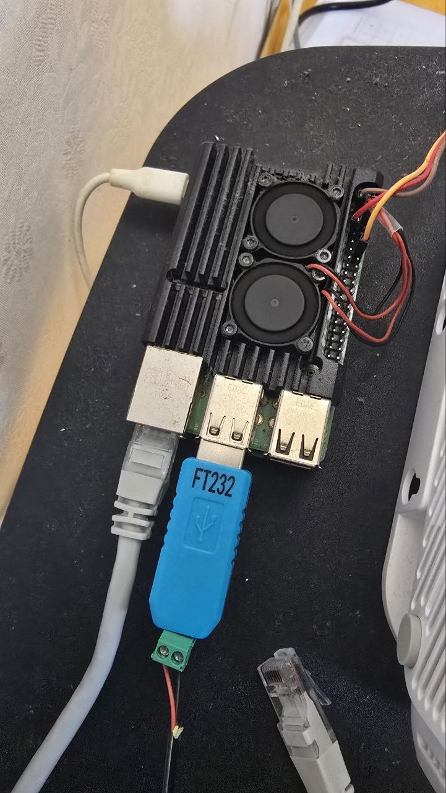
      </a>
      <br />Raspberry Pi 호스트 A
    </td>
    <td align="center">
      <a href="images/Photo-09-RaspberryPi.jpg">
        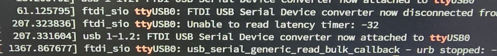
      </a>
      <br />Raspberry Pi 호스트 B
    </td>
  </tr>
</table>

## 수집 데이터 요약

현재 기본 protocol profile을 지원되는 InoElectric IEPVS-3.5-G1/G2 인버터와 함께 사용하면, 성공한 읽기마다 아래 핵심 값들이 생성됩니다.

| 분류 | 메트릭 | 의미 |
| --- | --- | --- |
| 메타데이터 | `@timestamp` | UTC 기준 수집 시각 |
| 메타데이터 | `inverter_name` | 설정된 인버터 이름 |
| 메타데이터 | `inverter_id` | 장치가 반환한 인버터 ID |
| DC 입력 | `input_dc_voltage_v` | PV 입력 DC 전압 |
| DC 입력 | `input_dc_current_a` | PV 입력 DC 전류 |
| DC 입력 | `input_dc_power_w` | PV 입력 DC 전력 |
| AC 출력 | `output_ac_voltage_v` | 계통 연계 AC 출력 전압 |
| AC 출력 | `output_ac_current_a` | 계통 연계 AC 출력 전류 |
| AC 출력 | `output_ac_power_w` | 계통 연계 AC 출력 전력 |
| AC 출력 | `output_ac_power_factor_pct` | 계통 연계 AC 출력 역률 |
| AC 출력 | `output_ac_frequency_hz` | 계통 연계 AC 출력 주파수 |
| 발전량 | `total_generation_kwh` | 누적 발전량 |
| 상태 | `fault_code` | 원시 인버터 fault 코드 |
| 디버그 | `raw_frame_hex` | 문제 확인용 원시 응답 프레임 |

같은 파싱 결과는 JSON으로 출력할 수 있고, 선택적으로 SQLite, Google Sheets, ThingSpeak, MariaDB, OpenSearch 또는 Elasticsearch에 기록할 수 있습니다. Telegram은 장애 이벤트 알림 채널로 사용합니다.

## 지원 인버터 범위

현재 코드는 InoElectric IEPVS-3.5-G1/G2 인버터 기준으로 작성 및 동작 테스트되었습니다.

요청 프레임, 응답 프레임 길이, 데이터 오프셋, 스케일링 규칙, CRC 순서, 메트릭 해석은 제품별로 다릅니다. 다른 인버터 모델을 사용하는 경우 먼저 해당 제품의 명세서나 매뉴얼을 확인한 뒤, 프로토콜 처리의 송신과 수신 모두를 제품에 맞게 수정해야 합니다.

- 요청 프레임: 제품별 요청 프레임에 맞게 `INVERTER_REQUEST_HEX`를 설정합니다. 사용하는 환경이나 문서에서 이를 TCP header 또는 protocol header라고 부른다면, 해당 제품별 헤더/요청 바이트를 이 값에 포함해서 다룹니다.
- 응답 검증: 제품 응답 형식에 맞게 `INVERTER_FRAME_LENGTH`, `INVERTER_DATA_LENGTH`, `INVERTER_CRC_ORDER`, `INVERTER_ID`를 설정합니다.
- 응답 파싱: 제품이 다른 바이트 오프셋, 다른 단위, 다른 스케일링으로 필드를 반환한다면 `src/solar_rs485_monitor/protocols/` 아래에 제품별 protocol module을 추가하고 `INVERTER_PROTOCOL`로 선택합니다.

새 제품 protocol module을 작성할 때는 `src/solar_rs485_monitor/protocols/inoelectric_iepvs_g1_g2.py`를 기준 예제로 삼습니다. 제품별 `parse_frame()`에서 프레임 검증, CRC 검증, payload 오프셋 해석, 단위 스케일링을 처리하고, `PROTOCOL` 객체에 요청 프레임과 기본 응답 길이, CRC 순서를 등록합니다. 새 module을 추가한 뒤에는 `src/solar_rs485_monitor/protocols/base.py`의 registry와 `tests/test_protocols.py`의 샘플 프레임 테스트도 함께 갱신합니다.

시리얼/TCP 연결이 성공했다고 해서 다른 RS485 인버터가 동일한 데이터 구조를 제공한다고 가정하면 안 됩니다.

## 현재 연결 방식

시리얼 연결은 `solar-rs485-monitor.conf`의 `SERIAL_PORT`로 설정합니다.

두 가지 방식을 지원합니다.

1. 로컬 USB RS485 어댑터
2. `socat`을 사용해 원격 RS485 호스트에 장착된 RS485 USB 어댑터에 TCP로 접근

내부적으로 코드는 `pyserial`의 `serial_for_url()`을 사용하므로, 일반 장치 경로와 pyserial URL을 같은 설정값으로 처리할 수 있습니다.

## SQLite 빠른 시작

외부 로깅 서비스 없이 데이터를 수집하고 저장된 행을 바로 확인하는 최소 절차입니다.

1. 가상환경을 생성합니다.

```bash
uv venv .venv
```

2. 해당 가상환경에 패키지를 설치합니다.

```bash
uv pip install --python .venv/bin/python solar-rs485-monitor
```

3. `/etc/solar-rs485-monitor.conf`에 설정 파일을 생성합니다.

```bash
./.venv/bin/solar-rs485-monitor --print-config-template | sudo tee /etc/solar-rs485-monitor.conf >/dev/null
```

4. `/etc/solar-rs485-monitor.conf`에서 최소한 아래 값을 실제 환경에 맞게 수정합니다.

생성되는 설정 템플릿은 dashboard, sink, alert, 운영 서비스 튜닝 옵션까지
포함하기 때문에 일부러 자세합니다. SQLite 빠른 시작에서는 대부분 무시해도
됩니다. 실제 인버터 통신을 위해 먼저 확인할 값은 보통 `SERIAL_PORT`,
`INVERTER_PROTOCOL`, `INVERTER_ID` 정도입니다. 로그, SQLite 행, 대시보드,
Telegram 메시지에서 인버터를 명확히 구분하려면 `INVERTER_NAME`도 실제
이름으로 설정하세요.

```env
# 인버터 통신과 식별에 필요한 핵심 값입니다.
SERIAL_PORT="/dev/ttyUSB0"
INVERTER_NAME="YOUR_INVERTER_NAME"
INVERTER_PROTOCOL="inoelectric_iepvs_g1_g2"
INVERTER_ID="1"

# 빠른 시작에서 사용할 저장 경로와 서비스 경로입니다.
SQLITE_PATH="/tmp/solar-rs485-monitor.sqlite3"
PYTHON_VENV_PATH="/absolute/path/to/.venv"
```

5. 수집을 시작하고 SQLite에 기록합니다.

```bash
./.venv/bin/solar-rs485-monitor --sqlite
```

6. 최근 데이터를 조회합니다.

```bash
sqlite3 -header -column /tmp/solar-rs485-monitor.sqlite3 \
"SELECT id, timestamp, input_dc_voltage_v, input_dc_power_w, output_ac_power_w, total_generation_kwh, fault_code FROM inverter_log ORDER BY id DESC LIMIT 10;"
```

## 설정 파일

런타임 설정은 `python-dotenv`로 파싱하는 `solar-rs485-monitor.conf` 형식을 사용합니다.

설정 파일 탐색 순서:

1. `/etc/solar-rs485-monitor.conf`
2. 명령을 실행하는 현재 작업 디렉터리의 `solar-rs485-monitor.conf`

PyPI로 시스템 전역 설치한 경우 `/etc` 아래에 설정 파일을 만듭니다.

```bash
solar-rs485-monitor --print-config-template | sudo tee /etc/solar-rs485-monitor.conf >/dev/null
sudo chmod 600 /etc/solar-rs485-monitor.conf
```

로컬 개발이나 소스 체크아웃에서는 명령을 실행하는 디렉터리에 설정 파일을 둡니다.

```bash
cp solar-rs485-monitor.conf.template solar-rs485-monitor.conf
```

로컬 `solar-rs485-monitor.conf`에는 실제 credential이 들어가므로 커밋하면 안 됩니다.

설정 템플릿에서는 측정값만 가져오는 최소 실행에 필요한 항목을 `[Required]`로 표시합니다.
최소 동작 테스트에서는 모든 `[Sink][Optional]`, `[Alert][Optional]` 설정을 사용하지 않고
`COLLECTOR_SINKS=""`, `ALERT_CHANNELS=""`로 두면 collector가 인버터를 읽고 JSON만 출력합니다.
`[Sink]`, `[Alert]` 표시는 이후에도 각 선택 설정이 어떤 기능에 속하는지 알려주는 용도로 유지합니다.

공통 설정:

```env
DASHBOARD_TITLE="Solar RS485 Monitor"
DASHBOARD_LANGUAGE="English"
DASHBOARD_SERVER_ADDRESS="0.0.0.0"
DASHBOARD_SERVER_PORT="8501"
DASHBOARD_SERVER_HEADLESS="true"
DASHBOARD_GATHER_USAGE_STATS="false"
DASHBOARD_RUN_ON_SAVE="false"
DASHBOARD_AUTO_REFRESH_SECONDS="60"
DASHBOARD_MAX_POINTS="10000"
DASHBOARD_DEFAULT_RANGE="Last 7 days"
DASHBOARD_TOTAL_GENERATION_DAYS="14"
DASHBOARD_DAILY_GENERATION_DAYS="14"
DASHBOARD_WEEKLY_GENERATION_WEEKS="16"
DASHBOARD_MONTHLY_GENERATION_MONTHS="12"
DASHBOARD_YEARLY_GENERATION_YEARS="10"
DASHBOARD_AUTH_ENABLED="false"
DASHBOARD_AUTH_USERS=""
DASHBOARD_AUTH_COOKIE_SECRET="CHANGE_ME_TO_A_LONG_RANDOM_SECRET"
DASHBOARD_AUTH_COOKIE_MAX_AGE_SECONDS="86400"
DASHBOARD_AUTH_COOKIE_PERSISTENT_USERS="admin"
COLLECT_INTERVAL="60"
PYTHON_VENV_PATH="/opt/myapp/.venv"
COLLECTOR_SINKS=""
ALERT_CHANNELS=""
```

`DASHBOARD_TITLE`은 Streamlit 대시보드의 브라우저 제목과 화면 상단 제목으로 사용됩니다.

`DASHBOARD_LANGUAGE`는 대시보드 시작 시 기본 UI 언어를 지정합니다. 대소문자를 구분하지 않으며 `English` 또는 `Korean` 값을 지원합니다. 로딩 이후에는 사이드바에서 사용자가 언어를 변경할 수 있습니다.

상단 상태 배지는 `fault_code`의 Bit 0(인버터 동작유무)로 `대기(STANDBY)`를 판정합니다. 장애 판정은 Bit 1+를 기준으로 하며, Bit 1+ 중 하나라도 활성화되면 `장애`, 그렇지 않고 Bit 0이 `1`이면 `STANDBY`, Bit 0이 `0`이면 `정상`으로 표시합니다.

`DASHBOARD_AUTO_REFRESH_SECONDS`는 대시보드 사이드바의 자동 새로고침 기본 선택값을 지정합니다. 지원 값은 `0`, `60`, `120`, `300`, `600`이며, 안전을 위해 `1`~`59`를 설정하면 `60`으로 보정됩니다.

`DASHBOARD_MAX_POINTS`는 차트 조회 시 사용할 최대 집계 포인트 수를 지정합니다. 이 값은 설정 파일에서만 변경할 수 있으며(대시보드 UI에서 직접 변경 불가), 허용 범위는 `100..300000`, 기본값은 `10000`입니다.

`DASHBOARD_DEFAULT_RANGE`는 대시보드 최초 진입 시 시작일/종료일 기본값을 계산하는 데 사용합니다. 기본값은 `Last 7 days`이며, 사용자는 사이드바에서 시작일과 종료일을 직접 변경할 수 있습니다.

`DASHBOARD_TOTAL_GENERATION_DAYS`, `DASHBOARD_DAILY_GENERATION_DAYS`, `DASHBOARD_WEEKLY_GENERATION_WEEKS`, `DASHBOARD_MONTHLY_GENERATION_MONTHS`, `DASHBOARD_YEARLY_GENERATION_YEARS`는 누적/일일/주간/월간/연간 발전량 차트의 최소 또는 고정 표시 기간을 지정합니다. 이 값은 설정 파일에서만 변경할 수 있으며 대시보드 UI에는 노출되지 않습니다.

`DASHBOARD_SERVER_ADDRESS`, `DASHBOARD_SERVER_PORT`, `DASHBOARD_SERVER_HEADLESS`, `DASHBOARD_GATHER_USAGE_STATS`, `DASHBOARD_RUN_ON_SAVE`는 Streamlit 대시보드 서버의 기본 실행 옵션입니다. 명령행에 Streamlit 옵션을 명시하면 해당 값이 우선합니다.

`DASHBOARD_AUTH_ENABLED`는 내장 대시보드 로그인을 활성화합니다. `DASHBOARD_AUTH_USERS`에는 `solar-rs485-monitor-dashboard --hash-password`로 생성한 `username:password_hash` 항목을 comma-separated 형식으로 저장합니다. `DASHBOARD_AUTH_COOKIE_SECRET`은 브라우저 로그인 쿠키 서명에 사용하며, `DASHBOARD_AUTH_COOKIE_MAX_AGE_SECONDS`는 일반 로그인 유지 시간을 제어합니다. `DASHBOARD_AUTH_COOKIE_PERSISTENT_USERS`에는 장기 유지 쿠키를 적용할 사용자명을 comma-separated 형식으로 지정합니다. 이 값을 비워도 하위 호환을 위해 `admin`은 persistent user로 동작합니다.

`COLLECT_INTERVAL`은 `--loop`가 주어졌을 때만 사용하는 기본 반복 수집 간격입니다. 명령행의 `--interval` 값은 loop mode를 의미하며 항상 `COLLECT_INTERVAL`보다 우선합니다. 과도한 수집을 줄이기 위해 60초보다 작은 값은 60초로 보정됩니다.

`PYTHON_VENV_PATH`는 샘플 systemd unit에서 collector와 dashboard 실행 전에 `PATH` 앞에 `${PYTHON_VENV_PATH}/bin`을 추가할 때 사용합니다.

`COLLECTOR_SINKS`는 명령행에 sink 옵션을 하나도 주지 않았을 때만 사용됩니다. `all` 또는 `mariadb,thingspeak,opensearch` 같은 comma-separated 목록을 사용합니다. 알 수 없는 sink 이름은 서비스 로그에 경고를 남긴 뒤 건너뜁니다.

`ALERT_CHANNELS`는 명령행에 alert 옵션을 하나도 주지 않았을 때만 사용됩니다. `all` 또는 `telegram` 같은 comma-separated 목록을 사용합니다.

## 설정

권장 설치 방법은 `uv`입니다.

```bash
uv venv --python 3.10 .venv
uv pip install --python .venv/bin/python solar-rs485-monitor
```

`uv`가 없는 환경에서는 표준 `pip`로도 설치할 수 있습니다. PyPI 패키지 메타데이터에 런타임 의존성이 포함되어 있으므로 별도 `requirements.txt`는 필요하지 않습니다.

```bash
python -m venv .venv
./.venv/bin/python -m pip install -U pip
./.venv/bin/python -m pip install solar-rs485-monitor
```

로컬 개발에서 `uv`와 프로젝트 `.venv`를 사용하는 경우:

```bash
uv venv --python 3.10 .venv
uv sync
uv pip install --python .venv/bin/python -e .
```

설치된 콘솔 명령으로 실행합니다.

```bash
solar-rs485-monitor
```

의존성이 설치되어 있다면 소스 체크아웃에서 직접 실행할 수도 있습니다.

```bash
python src/solar_rs485_monitor/collector.py
```

## 시리얼 설정

`solar-rs485-monitor.conf`를 수정해서 `SERIAL_PORT` 한 줄만 활성화합니다.

USB를 직접 사용하는 경우:

```env
SERIAL_PORT="/dev/ttyUSB0"
#SERIAL_PORT="socket://RS485_HOST_IP:9600"
```

현재 개발 구성처럼 RS485 USB 어댑터가 원격 RS485 호스트에 장착되어 있고 WSL에서 TCP로 접속하는 경우:

```env
#SERIAL_PORT="/dev/ttyUSB0"
SERIAL_PORT="socket://RS485_HOST_IP:9600"
```

두 줄을 파일에 함께 남겨둘 수는 있지만, 주석 해제된 줄은 반드시 하나여야 합니다. 둘 다 주석 해제되어 있으면 마지막으로 파싱된 값이 적용될 수 있어 실제 연결 대상이 불명확해집니다.

기타 시리얼 설정:

```env
SERIAL_BAUDRATE="9600"
SERIAL_TIMEOUT="1.0"
```

## 원격 RS485 호스트 TCP 포워딩

이 프로젝트 구성에서 원격 RS485 호스트는 인버터 RS485 USB 컨버터가 물리적으로 연결된 장비입니다. VS Code와 개발 작업이 WSL에서 실행될 수 있으므로, 해당 호스트에서 `/dev/ttyUSB0`을 `socat`으로 TCP 포워딩합니다.

```bash
/usr/bin/socat TCP-LISTEN:9600,reuseaddr,fork FILE:/dev/ttyUSB0,raw,echo=0
```

자동 시작이 필요하면 원격 RS485 호스트에 설치할 수 있는 systemd unit 샘플을 [packaging/systemd/rs485-tcp-bridge.service](packaging/systemd/rs485-tcp-bridge.service)에 제공합니다.

```bash
cp packaging/systemd/rs485-tcp-bridge.service /etc/systemd/system/rs485-tcp-bridge.service
systemctl daemon-reload
systemctl enable --now rs485-tcp-bridge
systemctl status rs485-tcp-bridge
```

클라이언트 연결이 끊어진 뒤에도 fork된 `socat` 자식 프로세스가 많이 남는다면 서비스를 중지하고 stale process를 정리한 뒤, 해당 호스트의 `ExecStart` 명령에 `-T 5` 또는 `max-children=1` 추가를 검토합니다.

그 다음 WSL 개발 환경의 `solar-rs485-monitor.conf`에 다음처럼 설정합니다.

```env
SERIAL_PORT="socket://RS485_HOST_IP:9600"
```

TCP 연결에서 인버터가 응답하지 않는다면 원격 RS485 호스트의 시리얼 장치 속도도 확인해야 합니다. 어댑터와 OS 설정에 따라 `socat`의 파일 옵션에 baud rate를 포함해야 할 수 있습니다.

```bash
/usr/bin/socat TCP-LISTEN:9600,reuseaddr,fork FILE:/dev/ttyUSB0,raw,echo=0,b9600
```

## 인버터 프로토콜 설정

인버터 요청과 예상 응답 형식도 `solar-rs485-monitor.conf`에서 설정합니다.

```env
INVERTER_NAME="YOUR_INVERTER_NAME"
INVERTER_PROTOCOL="inoelectric_iepvs_g1_g2"
INVERTER_ID="1"
INVERTER_REQUEST_HEX="7e0101d188"
INVERTER_FRAME_LENGTH="33"
INVERTER_DATA_LENGTH="26"
INVERTER_CRC_ORDER="LH"
```

현재 지원되는 protocol profile은 `inoelectric_iepvs_g1_g2`입니다. 사용 중인 인버터 매뉴얼에 다른 요청 프레임이 명시되어 있다면 `INVERTER_REQUEST_HEX`로 덮어쓸 수 있습니다.

`INVERTER_VERIFY_CRC`는 선택 항목이며 기본값은 `true`입니다.

```env
INVERTER_VERIFY_CRC="true"
```

## 인버터/REMS 데이터 패킷 규약

이 섹션은 현재 기본 protocol profile이 지원하는 InoElectric IEPVS-3.5-G1/G2 기준의 핵심 통신 규약입니다. 요청 프레임, 응답 프레임, 데이터 payload, `fault_code` 비트 해석을 한곳에 모았습니다.

지원 프로토콜은 신재생에너지 통합모니터링 시스템(REMS)용 프로토콜입니다.

다른 인버터 모델은 요청 명령, 응답 길이, 데이터 오프셋, 스케일, CRC 순서가 다를 수 있으므로 아래 값을 그대로 가정하면 안 됩니다.

### 프로토콜 처리 흐름

collector는 선택된 `INVERTER_PROTOCOL` profile에서 기본 요청 프레임과 `parse_frame()` 함수를 가져옵니다. 한 번의 읽기는 다음 순서로 진행됩니다.

1. `INVERTER_REQUEST_HEX` 요청 프레임을 RS485 연결로 전송합니다.
2. 설정된 `INVERTER_FRAME_LENGTH`만큼 응답 프레임을 수신합니다.
3. 프레임 길이, SOP `0x7E`, 인버터 ID, 응답 command `0x02`, 데이터 길이를 검증합니다.
4. `INVERTER_VERIFY_CRC=true`이면 마지막 2바이트 CRC를 `INVERTER_CRC_ORDER`에 맞게 읽고 CRC16/Modbus 계산값과 비교합니다.
5. 헤더 5바이트를 제외한 26바이트 payload를 제품 매뉴얼의 오프셋에 맞춰 해석합니다.
6. 역률, 주파수, 누적 발전량처럼 스케일이 있는 값은 공통 출력 단위로 변환합니다.
7. `inverter_name`, `inverter_id`, 계측값, `fault_code`, `raw_frame_hex`를 하나의 dict로 반환해 JSON 출력과 sink 저장에 사용합니다.

새 제품을 추가할 때는 이 흐름을 유지하되 요청 프레임, 응답 command, payload 길이, 필드 오프셋, endian, 스케일, CRC 방식이 제품 매뉴얼과 일치하는지 먼저 확인합니다.

### 요청 프레임

동작 테스트한 요청 프레임은 `7e 01 01 d1 88`입니다.

| 바이트 | 예시 값 | 의미 |
| ---: | ---: | --- |
| 0 | `0x7E` | SOP, 프레임 시작 |
| 1 | `0x01` | 국번, 인버터 ID (`0x01`..`0xNN`) |
| 2 | `0x01` | 요청 command |
| 3-4 | `0xD1 0x88` | CRC16 |

### 응답 프레임

기본 설정은 전체 응답 33바이트, 데이터 payload 26바이트입니다.

| 바이트 | 길이 | 의미 | 현재 profile 검증 |
| ---: | ---: | --- | --- |
| 0 | 1 | SOP, 프레임 시작 | `0x7E` |
| 1 | 1 | 국번, 인버터 ID | `INVERTER_ID`와 일치해야 함 |
| 2 | 1 | 응답 command | `0x02` |
| 3 | 1 | 데이터 길이 high byte | 데이터 길이 `0x001A`의 상위 바이트 |
| 4 | 1 | 데이터 길이 low byte | 데이터 길이 `0x001A`의 하위 바이트 |
| 5-30 | 26 | 데이터 payload | 아래 payload 표 기준으로 해석 |
| 31-32 | 2 | CRC16 | `INVERTER_CRC_ORDER`, 기본 `LH` |

멀티바이트 값은 big-endian unsigned integer로 디코딩합니다. 프로토콜은 REMS이며, 프레임 끝의 CRC는 현재 IEPVS-3.5-G1/G2에서 검증된 CRC16/Modbus 계산 방식으로 산출합니다. `LH`는 계산된 16비트 CRC 값을 low byte, high byte 순서로 프레임에 붙인다는 의미입니다. 예를 들어 요청 본문 `7e 01 01`의 CRC 값은 `0x88D1`이고, `LH` 순서로 붙이면 `d1 88`이 됩니다.

### 응답 데이터 형태

공식 매뉴얼의 응답 데이터는 아래 순서로 26바이트 payload에 들어옵니다. 현재 기본 profile은 이 순서를 그대로 사용합니다.

| 순서 | 매뉴얼 항목 | 데이터 바이트 | 길이 | 출력 필드 | 해석 |
| ---: | --- | ---: | ---: | --- | --- |
| 1 | PV 전압 | data 0-1 | 2 byte | `input_dc_voltage_v` | PV 입력 DC 전압 |
| 2 | PV 전류 | data 2-3 | 2 byte | `input_dc_current_a` | PV 입력 DC 전류 |
| 3 | PV 출력 | data 4-5 | 2 byte | `input_dc_power_w` | PV 입력 DC 전력 |
| 4 | 계통 전압 | data 6-7 | 2 byte | `output_ac_voltage_v` | 계통 연계 AC 출력 전압 |
| 5 | 계통 전류 | data 8-9 | 2 byte | `output_ac_current_a` | 계통 연계 AC 출력 전류 |
| 6 | 현재 출력 | data 10-11 | 2 byte | `output_ac_power_w` | 계통 연계 AC 출력 전력 |
| 7 | 역률 | data 12-13 | 2 byte | `output_ac_power_factor_pct` | 0.1 스케일, % |
| 8 | 주파수 | data 14-15 | 2 byte | `output_ac_frequency_hz` | 0.1 스케일, Hz |
| 9 | 누적 발전량 | data 16-23 | 8 byte | `total_generation_kwh` | 0.001 스케일, kWh |
| 10 | 고장 여부 | data 24-25 | 2 byte | `fault_code` | 비트마스크 |

### 출력 필드 해석

| 출력 필드 | 데이터 바이트 | 스케일 | 단위 | 설명 |
| --- | ---: | ---: | --- | --- |
| `@timestamp` | N/A | N/A | UTC ISO 8601 | UTC 기준 수집 시각 |
| `inverter_name` | N/A | N/A | text | `INVERTER_NAME` 값 |
| `inverter_id` | frame byte 1 | 1 | numeric ID | 장치가 반환한 인버터 ID |
| `input_dc_voltage_v` | data 0-1 | 1 | V | PV 입력 DC 전압 |
| `input_dc_current_a` | data 2-3 | 1 | A | PV 입력 DC 전류 |
| `input_dc_power_w` | data 4-5 | 1 | W | PV 입력 DC 전력 |
| `output_ac_voltage_v` | data 6-7 | 1 | V | 계통 연계 AC 출력 전압 |
| `output_ac_current_a` | data 8-9 | 1 | A | 계통 연계 AC 출력 전류 |
| `output_ac_power_w` | data 10-11 | 1 | W | 계통 연계 AC 출력 전력 |
| `output_ac_power_factor_pct` | data 12-13 | 0.1 | % | 계통 연계 AC 출력 역률 |
| `output_ac_frequency_hz` | data 14-15 | 0.1 | Hz | 계통 연계 AC 출력 주파수 |
| `total_generation_kwh` | data 16-23 | 0.001 | kWh | 누적 발전량 |
| `fault_code` | data 24-25 | 1 | code | 원시 fault 코드 |
| `raw_frame_hex` | full frame | N/A | hex bytes | 디버깅용 원시 응답 프레임 |

### fault_code 비트 해석

`fault_code`는 2바이트 unsigned 비트마스크입니다. 한 번의 응답에서 1개 이상의 비트가 동시에 활성화될 수 있으므로 단일 enum 값으로 해석하면 안 됩니다.

간단 규칙:

- 단일 비트만 켜진 경우: `fault_code`는 해당 비트의 값과 같습니다.
- 여러 비트가 동시에 켜진 경우: `fault_code`는 켜진 비트 값들의 합입니다.
- Bit 0은 운전 상태 비트입니다. `1`은 미작동, `0`은 동작중입니다.
- 장애 이벤트 판정은 Bit 1 이상을 기준으로 합니다.

| 비트 | 마스크(hex) | 값(10진수, 단일 비트) | 의미 (`1`일 때) |
| ---: | ---: | ---: | --- |
| 0 | `0x0001` | 1 | 인버터 미작동 |
| 1 | `0x0002` | 2 | 태양전지 과전압 |
| 2 | `0x0004` | 4 | 태양전지 저전압 |
| 3 | `0x0008` | 8 | 태양전지 과전류 |
| 4 | `0x0010` | 16 | 인버터 IGBT 에러 |
| 5 | `0x0020` | 32 | 인버터 과온 |
| 6 | `0x0040` | 64 | 계통 과전압 |
| 7 | `0x0080` | 128 | 계통 저전압 |
| 8 | `0x0100` | 256 | 계통 과전류 |
| 9 | `0x0200` | 512 | 계통 과주파수 |
| 10 | `0x0400` | 1024 | 계통 저주파수 |
| 11 | `0x0800` | 2048 | 단독운전(정전) |
| 12 | `0x1000` | 4096 | 지락(누전) |

예시:

- `fault_code = 2`: Bit 1만 활성, 태양전지 과전압
- `fault_code = 72`: Bit 3 + Bit 6 동시 활성, `8 + 64`

## 실행

설치된 버전을 확인합니다.

```bash
solar-rs485-monitor --version
```

한 번 수집하고 JSON을 출력합니다.

```bash
solar-rs485-monitor
```

명령행에서 포트를 임시로 덮어씁니다.

```bash
solar-rs485-monitor --port socket://RS485_HOST_IP:9600
```

`COLLECT_INTERVAL` 간격으로 반복 수집합니다.

```bash
solar-rs485-monitor --loop
```

명령행에서 반복 수집 간격을 임시로 덮어씁니다.

```bash
solar-rs485-monitor --interval 60
```

수집한 행을 Google Sheets에 기록합니다.

```bash
solar-rs485-monitor --google-sheet
```

수집한 데이터를 ThingSpeak에 기록합니다.

```bash
solar-rs485-monitor --thingspeak
```

장애 alert 메시지를 Telegram으로 전송합니다.

```bash
solar-rs485-monitor --telegram
```

수집한 데이터를 MariaDB에 기록합니다.

```bash
solar-rs485-monitor --mariadb
```

수집한 데이터를 Supabase(PostgreSQL)에 기록합니다.

```bash
solar-rs485-monitor --supabase
```

수집한 데이터를 SQLite에 기록합니다.

```bash
solar-rs485-monitor --sqlite
```

수집한 데이터를 OpenSearch 또는 Elasticsearch에 기록합니다.

```bash
solar-rs485-monitor --opensearch
```

반복 수집하면서 Google Sheets에 기록합니다.

```bash
solar-rs485-monitor --interval 60 --google-sheet
```

반복 수집하면서 ThingSpeak에 기록합니다.

```bash
solar-rs485-monitor --interval 60 --thingspeak
```

반복 수집하면서 Telegram으로 전송합니다.

```bash
solar-rs485-monitor --interval 60 --telegram
```

반복 수집하면서 MariaDB에 기록합니다.

```bash
solar-rs485-monitor --interval 60 --mariadb
```

반복 수집하면서 SQLite에 기록합니다.

```bash
solar-rs485-monitor --interval 60 --sqlite
```

반복 수집하면서 OpenSearch 또는 Elasticsearch에 기록합니다.

```bash
solar-rs485-monitor --interval 60 --opensearch
```

여러 sink를 함께 활성화할 수 있습니다.

```bash
solar-rs485-monitor --interval 60 --sqlite --google-sheet --thingspeak --mariadb --supabase --opensearch
```

설정된 모든 sink를 한 옵션으로 활성화할 수도 있습니다.

```bash
solar-rs485-monitor --loop --all-sinks
```

`--all-sinks`에서는 SQLite, Google Sheets, ThingSpeak, MariaDB가 활성화됩니다. OpenSearch는 `OPENSEARCH_URL`이 설정된 경우에만 활성화됩니다. OpenSearch 설정 누락을 오류로 확인하고 싶다면 `--opensearch`를 명시적으로 사용합니다.
이제 Supabase도 `--all-sinks`에 포함됩니다.

설정된 모든 alert 채널을 한 옵션으로 활성화할 수도 있습니다.

```bash
solar-rs485-monitor --loop --all-alerts
```

`--all-alerts`에서는 `TELEGRAM_BOT_TOKEN`과 `TELEGRAM_CHAT_IDS` 대상이 하나 이상 설정된 경우에만 Telegram이 활성화됩니다. Telegram 설정 누락을 오류로 확인하고 싶다면 `--telegram`을 명시적으로 사용합니다.

외부 sink/alert 실패는 서로 분리되어 처리됩니다. SQLite, Google Sheets, ThingSpeak, Telegram, MariaDB, OpenSearch가 credential 누락, 인증 실패, 네트워크 오류, rate limit, 파일시스템 권한 문제, 데이터베이스 연결 문제 등으로 실패하면 해당 채널의 구조화된 오류 이벤트를 출력하고 나머지 작업은 계속 진행합니다. 알 수 없는 `COLLECTOR_SINKS` 또는 `ALERT_CHANNELS` 이름은 경고 이벤트를 남긴 뒤 건너뜁니다. Telegram alert가 활성화되어 있으면 sink 실패와 반복 collector 실패도 Telegram으로 알릴 수 있습니다. 한 sink나 alert의 실패가 인버터 수집을 중단하거나 다른 활성 채널 실행을 막지 않습니다.

## systemd 서비스

systemd unit 샘플은 [packaging/systemd/solar-rs485-monitor.service](packaging/systemd/solar-rs485-monitor.service)에 있습니다. `EnvironmentFile`로 `/etc/solar-rs485-monitor.conf`를 읽고, `PYTHON_VENV_PATH`로 `PATH`를 구성합니다.

```ini
EnvironmentFile=/etc/solar-rs485-monitor.conf
StateDirectory=solar-rs485-monitor
ExecStart=/usr/bin/env PATH=${PYTHON_VENV_PATH}/bin:/usr/local/sbin:/usr/local/bin:/usr/sbin:/usr/bin:/sbin:/bin solar-rs485-monitor --loop
```

설치 전에 `/etc/solar-rs485-monitor.conf`의 `PYTHON_VENV_PATH`를 실제 virtualenv 루트(예: `/opt/myapp/.venv`)로 설정합니다.

서비스는 일반 설정 파일 탐색 순서를 사용합니다. 특별한 이유가 없다면 데몬용 설정은 `/etc/solar-rs485-monitor.conf`에 둡니다. 데몬 수집 간격이나 sink/alert 선택은 systemd unit을 수정하지 말고 이 설정 파일의 `COLLECT_INTERVAL`, `COLLECTOR_SINKS`, `ALERT_CHANNELS` 값을 변경합니다.

설치 예시:

```bash
sudo cp packaging/systemd/solar-rs485-monitor.service /etc/systemd/system/
solar-rs485-monitor --print-config-template | sudo tee /etc/solar-rs485-monitor.conf >/dev/null
sudo chmod 600 /etc/solar-rs485-monitor.conf
sudo systemctl daemon-reload
sudo systemctl enable --now solar-rs485-monitor
```

서비스 제어 명령:

```bash
sudo systemctl status solar-rs485-monitor
sudo systemctl stop solar-rs485-monitor
sudo systemctl start solar-rs485-monitor
sudo journalctl -u solar-rs485-monitor -f
```

서비스에서 일부 sink만 사용하려면 `--all-sinks` 대신 `--sqlite` 또는 `--sqlite --thingspeak --mariadb --opensearch` 같은 명시적 옵션으로 바꿉니다. alert는 `--telegram` 또는 `--all-alerts`를 사용합니다.

## Telegram 설정

Telegram alert(`--telegram` 또는 `--all-alerts`)를 사용하려면 `solar-rs485-monitor.conf`에 다음 값을 설정합니다.

```env
TELEGRAM_BOT_TOKEN="YOUR_TELEGRAM_BOT_TOKEN"
TELEGRAM_CHAT_IDS=""
TELEGRAM_MESSAGE_THREAD_ID=""
TELEGRAM_TIMEOUT="5.0"
TELEGRAM_DISABLE_NOTIFICATION="false"
TELEGRAM_PARSE_MODE="Markdown"
TELEGRAM_SEND_SUMMARY="false"
TELEGRAM_SEND_FAULT_EVENT="true"
TELEGRAM_SEND_SINK_ERROR="true"
TELEGRAM_SEND_SYSTEM_ERROR="true"
TELEGRAM_SEND_STANDBY_EVENT="true"
ALERT_COOLDOWN_SECONDS="900"
COLLECTOR_FAILURE_ALERT_THRESHOLD="3"
COLLECTOR_STATE_PATH="/var/lib/solar-rs485-monitor/collector-state.json"
COLLECTOR_STATE_MAX_AGE_SECONDS="86400"
COLLECTOR_STANDBY_NO_RESPONSE_SUPPRESS="true"
COLLECTOR_STANDBY_POWER_W_THRESHOLD="20"
COLLECTOR_NORMAL_POWER_W_THRESHOLD="30"
COLLECTOR_UNKNOWN_STATE_NO_RESPONSE_SUPPRESS_SECONDS="43200"
```

`TELEGRAM_BOT_TOKEN`은 BotFather에서 발급받은 봇 API 토큰입니다. `TELEGRAM_CHAT_IDS`는 fan-out 전송 대상 채팅/그룹 ID를 comma-separated 형식으로 설정합니다. Telegram 포럼 토픽에 보내려면 `TELEGRAM_MESSAGE_THREAD_ID`를 설정합니다.

대상이 여러 개일 때는 모든 대상에 전송을 시도하며, 일부 대상 전송 실패가 다른 대상 전송을 중단시키지 않습니다.

기본 동작은 alert 채널에서 정상 측정값을 스킵하고, 장애 이벤트(운전 상태 비트인 Bit 0 제외, Bit 1+ 중 하나라도 활성)가 감지될 때만 메시지를 전송합니다. 장애 이벤트 메시지에는 주요 측정값과 활성 fault bit 정보가 포함됩니다. 이벤트 시 요약 메시지도 함께 보내려면 `TELEGRAM_SEND_SUMMARY="true"`로 설정하세요.

`TELEGRAM_SEND_SINK_ERROR="true"`이면 활성화된 sink의 초기화/전송/insert 실패도 Telegram으로 전송합니다. `TELEGRAM_SEND_SYSTEM_ERROR="true"`이면 collector 실패가 `COLLECTOR_FAILURE_ALERT_THRESHOLD`회 연속 발생했을 때 Telegram으로 알리고, 이후 수집이 다시 성공하면 복구 메시지를 보냅니다. `ALERT_COOLDOWN_SECONDS`는 같은 event/error의 운영 알림 반복 전송을 제한합니다.

collector는 마지막 인버터 상태를 `COLLECTOR_STATE_PATH`에 기록합니다. `COLLECTOR_STANDBY_NO_RESPONSE_SUPPRESS="true"`이고 이 상태 파일이 장애 없는 standby/off 상태를 가리키면, `No response from inverter`는 예상 가능한 standby 동작으로 로그만 남기고 system error alert는 보내지 않습니다. 상태 파일이 삭제되었거나 없거나 손상되었거나 `COLLECTOR_STATE_MAX_AGE_SECONDS`보다 오래되면 상태를 알 수 없는 것으로 봅니다. 서비스 시작 후 `COLLECTOR_UNKNOWN_STATE_NO_RESPONSE_SUPPRESS_SECONDS`초 동안은 상태를 알 수 없는 `No response from inverter`도 system error alert 없이 로그만 남깁니다. 이 grace 기간이 지난 뒤에는 다음 정상 수집이 파일을 다시 만들 때까지 기존 연속 실패 threshold 정책을 사용합니다.

standby 판정은 `fault_code` Bit 0을 가장 신뢰합니다. Bit 1+ 장애가 없고 Bit 0을 받지 못한 정상 응답에서는 보완책으로 AC 출력 전력을 봅니다. `output_ac_power_w <= COLLECTOR_STANDBY_POWER_W_THRESHOLD`이면 일몰 쪽 저출력 상태로 보고 standby로 전환합니다. 반대로 `output_ac_power_w >= COLLECTOR_NORMAL_POWER_W_THRESHOLD`이면 일출 쪽 출력 회복으로 보고 normal로 전환합니다. 두 값 사이, 예를 들어 기본값 기준 20W 초과 30W 미만 구간은 판단을 뒤집기 애매한 완충 구간이므로 이전 상태를 유지해 일몰/일출 경계에서 standby/normal 알림이 반복되는 것을 막습니다.

Telegram은 기본적으로 인버터 대기/오프 전환과 정상 복귀 전환도 알립니다. 끄려면 `TELEGRAM_SEND_STANDBY_EVENT="false"`로 설정하세요. 이 옵션은 `fault_code` Bit 0 전환 또는 위 전력 기반 보완 판정으로 상태가 바뀌는 시점에만 1회 전송하도록 동작하므로, 야간 저전력 상태에서 같은 알림이 반복 전송되는 것을 방지합니다. 단, Bit 1+ 장애 비트가 켜져 있으면 정상/standby 이벤트보다 장애 이벤트로 처리합니다.

## 대시보드

Streamlit 대시보드는 수집기와 같은 `solar-rs485-monitor.conf` 탐색 순서를 사용한 뒤, MariaDB 또는 SQLite를 조회해서 메트릭 차트를 표시합니다. MariaDB가 기본 선택값입니다.

로컬 실행:

```bash
solar-rs485-monitor-dashboard
```

대시보드 명령의 버전을 확인합니다.

```bash
solar-rs485-monitor-dashboard --version
```

브라우저에서 출력된 Streamlit URL을 엽니다. 사이드바에서 데이터 소스, 시작일, 종료일을 선택할 수 있습니다. 시작일과 종료일이 같으면 해당 날짜 하루만 조회합니다. 종료일은 시작일 이전으로 선택할 수 없고, 시작일/종료일 모두 오늘 이후 날짜는 선택할 수 없습니다. 시작일/종료일의 최초 기본값은 `DASHBOARD_DEFAULT_RANGE`로 계산됩니다.

대시보드는 상단에 인버터 이름과 ID를 표시하고, 수집되는 각 메트릭을 개별 차트로 렌더링합니다. 데이터베이스 전송량과 브라우저 렌더링 부담을 줄이기 위해 조회 결과는 차트 표시 전에 선택 가능한 1분, 2분, 5분, 10분, 15분, 30분, 1시간, 3시간, 6시간, 12시간 단위로 집계됩니다. 또한 선택한 기간과 `DASHBOARD_MAX_POINTS` 값에 따라 선택 가능한 최소 집계 단위가 동적으로 상향됩니다. 누적/일일 발전량 차트는 조회 종료일 기준으로 최소 14일, 주간 발전량 차트는 최소 16주를 표시합니다. 월간/연간 발전량 차트는 설정 파일의 고정 기간을 사용하며 기본값은 12개월/10년입니다.

대시보드 서버 옵션은 `solar-rs485-monitor.conf`의 `DASHBOARD_SERVER_ADDRESS`, `DASHBOARD_SERVER_PORT`, `DASHBOARD_SERVER_HEADLESS`, `DASHBOARD_GATHER_USAGE_STATS`, `DASHBOARD_RUN_ON_SAVE`에서 읽습니다. 사이드바 자동 새로고침 기본 선택값은 `DASHBOARD_AUTO_REFRESH_SECONDS`로 지정할 수 있고, 실행 중에는 사용자가 사이드바에서 다시 변경할 수 있습니다. 선택된 간격은 브라우저 페이지 전체를 reload하지 않고 대시보드 본문 영역을 갱신합니다. 명령행에서 Streamlit 서버 옵션을 override하려면:

```bash
solar-rs485-monitor-dashboard --server.address 0.0.0.0 --server.port 8501 --server.headless true --browser.gatherUsageStats false
```

선택적 대시보드 로그인은 로컬 PBKDF2-SHA256 비밀번호 해시를 사용하며 외부 인증 서비스가 필요 없습니다. 해시를 생성한 뒤 `/etc/solar-rs485-monitor.conf`에 추가합니다.

```bash
solar-rs485-monitor-dashboard --hash-password
```

```env
DASHBOARD_AUTH_ENABLED="true"
DASHBOARD_AUTH_USERS="admin:pbkdf2_sha256$260000$..."
DASHBOARD_AUTH_COOKIE_SECRET="replace-with-a-long-random-secret"
DASHBOARD_AUTH_COOKIE_MAX_AGE_SECONDS="86400"
DASHBOARD_AUTH_COOKIE_PERSISTENT_USERS="admin,susunwha"
```

사용자가 여러 명이면 comma로 구분합니다. 로그인 상태는 서명된 브라우저 쿠키에 저장되므로, 쿠키가 만료되기 전에는 페이지 새로고침 후에도 다시 로그인하지 않습니다. `DASHBOARD_AUTH_COOKIE_PERSISTENT_USERS`에 포함된 사용자는 persistent user로 취급되어 로그아웃하거나 쿠키가 삭제되거나 cookie secret이 변경되기 전까지 로그인 상태가 유지됩니다. 이 기능은 애플리케이션 레벨 로그인입니다. 신뢰된 LAN 밖으로 대시보드를 노출할 때는 HTTPS, reverse proxy, 방화벽 규칙, 사설망 접근 제어를 함께 사용하세요.

선택적으로 사용할 수 있는 systemd unit 샘플은 [packaging/systemd/solar-rs485-monitor-dashboard.service](packaging/systemd/solar-rs485-monitor-dashboard.service)에 있습니다. 이 unit도 `EnvironmentFile=/etc/solar-rs485-monitor.conf`와 `PYTHON_VENV_PATH`를 사용해 virtualenv `PATH`에서 명령을 찾습니다.

```bash
sudo cp packaging/systemd/solar-rs485-monitor-dashboard.service /etc/systemd/system/
sudo systemctl daemon-reload
sudo systemctl enable --now solar-rs485-monitor-dashboard
```

대시보드 서비스 제어 명령:

```bash
sudo systemctl status solar-rs485-monitor-dashboard
sudo journalctl -u solar-rs485-monitor-dashboard -f
```

## 패키지 빌드

이 프로젝트는 PyPI 패키지 구조로 구성되어 있습니다.

source distribution과 wheel을 생성합니다.

```bash
uv build
```

빌드 결과는 `dist/` 아래에 생성됩니다.

```text
dist/solar_rs485_monitor-VERSION.tar.gz
dist/solar_rs485_monitor-VERSION-py3-none-any.whl
```

PyPI 등록은 `.github/workflows/pypi-publish.yml`의 GitHub Actions workflow로 처리하거나, 패키지를 빌드하고 검증한 뒤 `uv publish`로 수동 등록할 수 있습니다.

## ThingSpeak 설정

`--thingspeak`를 사용하려면 `solar-rs485-monitor.conf`에 ThingSpeak Write API Key를 설정합니다.

```env
THINGSPEAK_API_KEY="YOUR_THINGSPEAK_WRITE_API_KEY"
THINGSPEAK_TIMEOUT="5.0"
```

ThingSpeak field 매핑은 채널 구성에 맞춰 고정되어 있습니다.

| ThingSpeak field | 메트릭 |
| --- | --- |
| `field1` | `input_dc_voltage_v` |
| `field2` | `input_dc_current_a` |
| `field3` | `input_dc_power_w` |
| `field4` | `output_ac_voltage_v` |
| `field5` | `output_ac_current_a` |
| `field6` | `output_ac_power_w` |
| `field7` | `total_generation_kwh` |
| `field8` | `fault_code` |

ThingSpeak는 업데이트가 거부되면 `0`을 반환합니다. 흔한 원인은 잘못된 Write API Key 또는 너무 짧은 업데이트 간격입니다. 반복 업데이트에는 최소 15초 이상의 간격을 사용합니다.

## MariaDB 설정

`--mariadb`를 사용하려면 `solar-rs485-monitor.conf`에 다음 값을 설정합니다.

```env
MARIADB_HOST="YOUR_MARIADB_HOST"
MARIADB_PORT="3306"
MARIADB_USER="solar_logger"
MARIADB_PASSWORD="YOUR_MARIADB_PASSWORD"
MARIADB_DATABASE="solar_rs485_monitor"
MARIADB_TABLE="inverter_log"
MARIADB_CONNECT_TIMEOUT="5.0"
```

MariaDB sink는 대상 테이블이 없으면 자동으로 생성하며, timestamp/inverter_id/fault_code 인덱스도 함께 생성합니다. 현재 sink 스키마에 정의된 파싱 메트릭만 insert하며, `raw_frame_hex`는 디버깅용 JSON 출력에는 포함되지만 MariaDB에는 저장하지 않습니다. 저장하려면 테이블과 sink를 함께 확장해야 합니다.

단, 선택한 데이터베이스 자체는 미리 존재해야 하며 최초 실행 시 테이블/인덱스 생성 권한이 필요합니다.

일반 로깅에는 데이터베이스 사용자에게 `INSERT` 권한만 있으면 됩니다. `SELECT` 권한은 검증이나 대시보드 구성에 유용합니다.

MariaDB 스키마와 로깅 사용자 생성 예시(선택적 사전 준비):

```sql
CREATE DATABASE IF NOT EXISTS solar_rs485_monitor
  CHARACTER SET utf8mb4
  COLLATE utf8mb4_general_ci;

USE solar_rs485_monitor;

CREATE TABLE IF NOT EXISTS inverter_log (
    id                   BIGINT UNSIGNED AUTO_INCREMENT PRIMARY KEY,
    timestamp            DATETIME(6) NOT NULL COMMENT 'UTC measurement time',
    inverter_name        VARCHAR(100) NOT NULL,
    inverter_id          TINYINT UNSIGNED NOT NULL,
    input_dc_voltage_v   SMALLINT UNSIGNED COMMENT 'DC input voltage (V)',
    input_dc_current_a   FLOAT(5,2) COMMENT 'DC input current (A)',
    input_dc_power_w     INT UNSIGNED COMMENT 'DC input power (W)',
    output_ac_voltage_v  SMALLINT UNSIGNED COMMENT 'AC output voltage (V)',
    output_ac_current_a  FLOAT(5,2) COMMENT 'AC output current (A)',
    output_ac_power_w    INT UNSIGNED COMMENT 'AC output power (W)',
    output_ac_power_factor_pct FLOAT(5,2) COMMENT 'AC output power factor (%)',
    output_ac_frequency_hz     FLOAT(5,2) COMMENT 'AC output frequency (Hz)',
    total_generation_kwh FLOAT(10,3) COMMENT 'Total generation (kWh)',
    fault_code           SMALLINT UNSIGNED DEFAULT 0 COMMENT 'Fault code',
    created_at           TIMESTAMP DEFAULT CURRENT_TIMESTAMP COMMENT 'DB insert time',
    INDEX idx_timestamp (timestamp),
    INDEX idx_inverter_id (inverter_id),
    INDEX idx_fault_code (fault_code)
) ENGINE=InnoDB
  DEFAULT CHARSET=utf8mb4
  COMMENT='solar-rs485-monitor inverter log';

CREATE USER 'solar_logger'@'%' IDENTIFIED BY 'YOUR_STRONG_PASSWORD';
GRANT INSERT, SELECT ON solar_rs485_monitor.inverter_log TO 'solar_logger'@'%';

FLUSH PRIVILEGES;
```

`'%'` host는 모든 IP에서 원격 접속을 허용합니다. 운영 환경에서는 가능하면 수집기 호스트 IP로 제한하는 편이 좋습니다.

## Supabase(PostgreSQL) 설정

`--supabase`를 사용하려면 `solar-rs485-monitor.conf`에 다음 값을 설정합니다.

```env
SUPABASE_HOST="YOUR_SUPABASE_HOST"
SUPABASE_PORT="5432"
SUPABASE_USER="YOUR_SUPABASE_USER"
SUPABASE_PASSWORD="YOUR_SUPABASE_PASSWORD"
SUPABASE_DATABASE="postgres"
SUPABASE_SCHEMA="public"
SUPABASE_TABLE="inverter_log"
SUPABASE_CONNECT_TIMEOUT="5.0"
```

참고:

- Supabase 프로젝트의 Direct Connection이 IPv6 전용인 경우, IPv4만 지원하는 클라이언트에서는 Session Pooler를 사용해야 합니다. 이때 풀러(host)와 풀러 사용자명을 사용하세요. 예:
  - host: `aws-1-<region>.pooler.supabase.com` (예: `aws-1-ap-northeast-2.pooler.supabase.com`)
  - user: `postgres.<project_ref>` (예: `postgres.jupglvkymeilpprzjxmv`)
  - database: `postgres`
  - port: `5432`
- Supabase sink는 대상 스키마/테이블/인덱스가 없으면 자동으로 생성합니다. 파싱된 모든 메트릭(`raw_frame_hex` 포함)을 insert합니다.
- 데이터베이스 자체는 이미 존재해야 하며(기본값 `postgres`), 최초 실행 시 객체 생성 권한이 필요합니다.

sink가 자동으로 생성하는 PostgreSQL 스키마(참고용):

```sql
CREATE SCHEMA IF NOT EXISTS "public";

CREATE TABLE IF NOT EXISTS "public"."inverter_log" (
    id BIGSERIAL PRIMARY KEY,
    "timestamp" TIMESTAMPTZ NOT NULL,
    inverter_name TEXT NOT NULL,
    inverter_id INTEGER NOT NULL,
    input_dc_voltage_v INTEGER,
    input_dc_current_a DOUBLE PRECISION,
    input_dc_power_w INTEGER,
    output_ac_voltage_v INTEGER,
    output_ac_current_a DOUBLE PRECISION,
    output_ac_power_w INTEGER,
    output_ac_power_factor_pct DOUBLE PRECISION,
    output_ac_frequency_hz DOUBLE PRECISION,
    total_generation_kwh DOUBLE PRECISION,
    fault_code INTEGER DEFAULT 0,
    raw_frame_hex TEXT,
    created_at TIMESTAMPTZ DEFAULT NOW()
);

CREATE INDEX IF NOT EXISTS idx_inverter_log_timestamp
  ON "public"."inverter_log" ("timestamp");
CREATE INDEX IF NOT EXISTS idx_inverter_log_inverter_id
  ON "public"."inverter_log" (inverter_id);
CREATE INDEX IF NOT EXISTS idx_inverter_log_fault_code
  ON "public"."inverter_log" (fault_code);
```

실행 예:

```bash
solar-rs485-monitor --supabase
```

## SQLite 설정

SQLite는 가장 간단한 로컬 로깅 sink입니다. Python 표준 라이브러리만 사용하며, 데이터베이스 서버, 사용자 계정, 비밀번호, 네트워크 접근이 필요 없습니다.

```env
SQLITE_PATH="solar-rs485-monitor.sqlite3"
SQLITE_TABLE="inverter_log"
```

실행 예:

```bash
solar-rs485-monitor --sqlite
```

데이터베이스 파일과 테이블은 자동 생성됩니다. `SQLITE_PATH`가 상대 경로이면 명령을 실행한 현재 작업 디렉터리 기준으로 해석됩니다. systemd에서는 아래처럼 절대 경로를 사용하는 편이 좋습니다.

```env
SQLITE_PATH="/var/lib/solar-rs485-monitor/solar-rs485-monitor.sqlite3"
```

자동 생성되는 SQLite 테이블은 다음과 같습니다.

```sql
CREATE TABLE IF NOT EXISTS inverter_log (
    id INTEGER PRIMARY KEY AUTOINCREMENT,
    timestamp TEXT NOT NULL,
    inverter_name TEXT NOT NULL,
    inverter_id INTEGER NOT NULL,
    input_dc_voltage_v INTEGER,
    input_dc_current_a REAL,
    input_dc_power_w INTEGER,
    output_ac_voltage_v INTEGER,
    output_ac_current_a REAL,
    output_ac_power_w INTEGER,
    output_ac_power_factor_pct REAL,
    output_ac_frequency_hz REAL,
    total_generation_kwh REAL,
    fault_code INTEGER DEFAULT 0,
    raw_frame_hex TEXT,
    created_at TEXT DEFAULT CURRENT_TIMESTAMP
);
```

## OpenSearch 설정

`--opensearch`를 사용하려면 `solar-rs485-monitor.conf`에 다음 값을 설정합니다.

```env
OPENSEARCH_URL="https://YOUR_OPENSEARCH_HOST:9200"
OPENSEARCH_INDEX="solar-rs485-monitor"
OPENSEARCH_USERNAME=""
OPENSEARCH_PASSWORD=""
OPENSEARCH_TIMEOUT="5.0"
OPENSEARCH_VERIFY_TLS="true"
```

OpenSearch sink는 수집한 인버터 문서를 아래 API로 기록합니다.

```text
POST /solar-rs485-monitor/_doc
```

클러스터가 basic authentication을 요구하면 `OPENSEARCH_USERNAME`과 `OPENSEARCH_PASSWORD`를 함께 설정합니다. 자체 서명 TLS 인증서를 쓰는 환경에서는 호스트에 CA 인증서를 설치하거나 해당 환경에서 `OPENSEARCH_VERIFY_TLS="false"`를 설정합니다.

## Google Sheets 설정

`--google-sheet`를 사용하려면 `solar-rs485-monitor.conf`에 다음 값을 설정합니다.

```env
GOOGLE_SHEET_FILE_NAME="YOUR_GOOGLE_SHEET_FILE_NAME"
GOOGLE_WORKSHEET_NAME=""
```

`GOOGLE_SHEET_FILE_NAME`은 베이스 이름으로 사용됩니다. 실행 시에는 `<GOOGLE_SHEET_FILE_NAME>-YYYY` 형식의 연도별 스프레드시트(예: `Solar-RS485-Monitor-2026`)에 자동 기록합니다.

각 연도 스프레드시트 안에서는 `YYYY-01`부터 `YYYY-12`까지 월별 워크시트를 자동으로 관리합니다. 없는 월 워크시트는 자동 생성되며, 데이터는 수집 시점의 월에 해당하는 워크시트에 기록됩니다.

`GOOGLE_WORKSHEET_NAME`은 하위 호환을 위해 남아 있으며, 현재는 워크시트 회전 제어에 사용되지 않습니다.

또한 `solar-rs485-monitor.conf.template`에 있는 Google 서비스 계정 필드도 입력해야 합니다.

스프레드시트는 서비스 계정 이메일에 공유되어 있어야 합니다.

```env
GOOGLE_CLIENT_EMAIL="service-account@your-project-id.iam.gserviceaccount.com"
```

워크시트가 비어 있으면 수집기가 헤더 행을 자동 생성합니다. 1행이 이미 존재하고 예상 스키마와 다르면 헤더 불일치 오류와 함께 스크립트가 중단됩니다.

## 출력

스크립트는 수집 시도마다 JSON 객체 하나를 출력합니다.

출력 필드와 `fault_code` 비트 해석은 위의 [인버터/REMS 데이터 패킷 규약](#인버터rems-데이터-패킷-규약)에 모았습니다.

성공한 읽기 결과 예시:

```json
{
  "@timestamp": "2026-07-01T10:16:13.844550+00:00",
  "inverter_name": "Inoelectric IEPVS-3.5-G1",
  "inverter_id": 1,
  "input_dc_voltage_v": 193,
  "input_dc_current_a": 0,
  "input_dc_power_w": 54,
  "output_ac_voltage_v": 229,
  "output_ac_current_a": 0,
  "output_ac_power_w": 37,
  "output_ac_power_factor_pct": 85.0,
  "output_ac_frequency_hz": 60.0,
  "total_generation_kwh": 112.244,
  "fault_code": 0,
  "raw_frame_hex": "7e 01 02 00 1a 00 c1 00 00 00 36 00 e5 00 00 00 25 03 52 02 58 00 00 00 00 00 01 b6 74 00 00 7c 21"
}
```

오류도 JSON으로 출력됩니다.

```json
{
  "@timestamp": "2026-06-29T00:00:00+00:00",
  "inverter_name": "YOUR_INVERTER_NAME",
  "error": "No response from inverter"
}
```

## 문제 해결

- `No response from inverter`: `SERIAL_PORT`, 원격 RS485 호스트 IP, TCP 포트, RS485 배선, 인버터 ID, baud rate를 확인합니다.
- 원시 응답 확인이 필요하면 `uv run python tools/capture_raw_frames.py --port /dev/ttyUSB0 --try-crc-orders`로 실제 TX/RX 프레임을 확인합니다.
- `Connection refused`: `socat`이 실행 중이 아니거나, IP/포트가 틀렸거나, 방화벽이 접근을 막고 있을 수 있습니다.
- `CRC mismatch`: `INVERTER_CRC_ORDER`, 요청 바이트, 예상 프레임 길이가 실제 인버터 응답과 맞는지 확인합니다.
- `ThingSpeak update rejected`: `THINGSPEAK_API_KEY`를 확인하고 업데이트 간격을 최소 15초 이상으로 설정합니다.
- `MARIADB_PASSWORD is not set`: `--mariadb` 실행 전에 `solar-rs485-monitor.conf`에 MariaDB 비밀번호를 설정합니다.
- `MariaDB logging failed`: `MARIADB_HOST`, `MARIADB_PORT`, 방화벽 정책, DB 권한, 사용자 이름, 비밀번호, 데이터베이스 이름, 테이블 이름을 확인합니다.
- `SUPABASE_PASSWORD is not set` 또는 `SUPABASE_* is not set`: `--supabase` 실행 전에 필요한 Supabase 항목을 `solar-rs485-monitor.conf`에 설정합니다.
- `Supabase logging failed` 또는 `failed to resolve host ... No address associated with hostname`: Supabase Direct Connection이 IPv6 전용인 경우 Session Pooler host와 풀러 사용자명(예: `aws-1-<region>.pooler.supabase.com`, `postgres.<project_ref>`)을 사용하세요. 또한 host, port, 방화벽 정책, 사용자명/비밀번호, database/schema/table 값을 확인합니다.
- `psycopg is required for Supabase logging`: 프로젝트 의존성을 설치하여 `psycopg` 패키지가 사용 가능해야 합니다.
- `SQLite unable to open database file`: `SQLITE_PATH`와 디렉터리 쓰기 권한을 확인합니다.
- `OPENSEARCH_URL is not set`: `--opensearch` 실행 전에 OpenSearch endpoint를 설정합니다.
- `OpenSearch request failed`: endpoint, index 권한, 사용자 이름, 비밀번호, TLS 설정, 클러스터 네트워크 접근을 확인합니다.
- `Telegram request failed`: `TELEGRAM_BOT_TOKEN`, `TELEGRAM_CHAT_IDS`, 대상 그룹의 봇 권한, `api.telegram.org`로의 네트워크 접근을 확인합니다.
- `Google Sheet not found or access denied`: 스프레드시트를 `GOOGLE_CLIENT_EMAIL`에 공유합니다.
- `Google worksheet header mismatch`: 워크시트 1행 헤더가 현재 스키마와 일치하는지 확인합니다.
